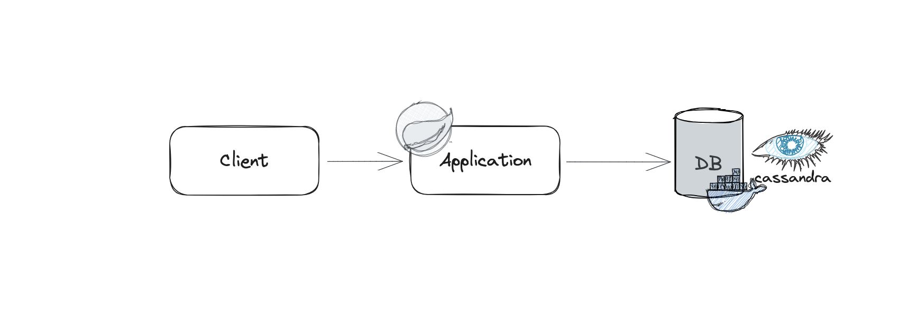
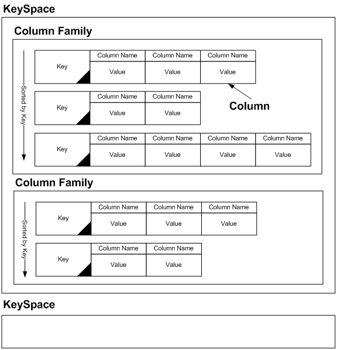
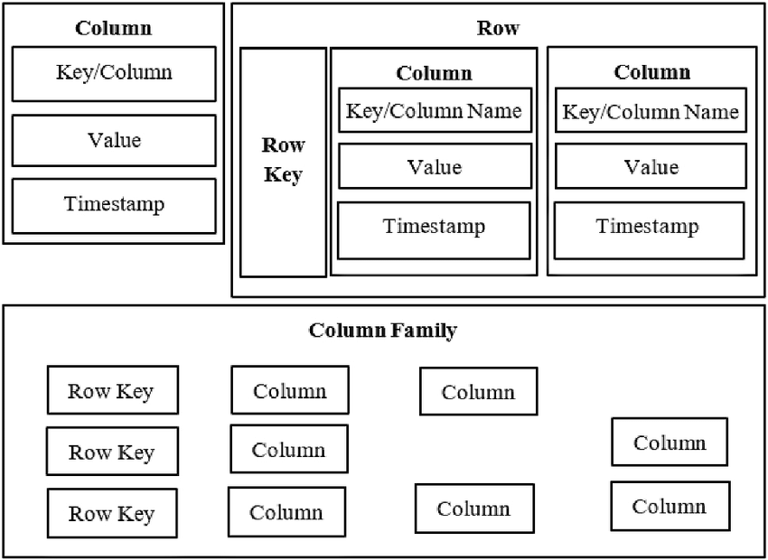

# Spring Boot 3 Cassandra JPA Demo

This is demo project of Spring Boot 3 with Cassandra Database

Code: `JTSP - 3 - 3 - 1`

## Architecture

## Tech Stack

+ Spring Boot 3
+ Cassandra 
+ Maven
+ Docker
+ Postman

## Cassandra Docker Commands

Start Cassandra in Docker
```shell
docker run --name cassandra -d -p 9042:9042 cassandra:latest
```

+ `docker run`: Runs a new container.
+ `--name cassandra`: Names the container "cassandra".
+ `-d`: Runs the container in detached mode.
+ `-p 9042:9042`: Maps port 9042 on the host to port 9042 on the container, allowing you to access Cassandra from your local machine.
cassandra:latest: Specifies the Cassandra image to use. This will pull the latest version of the Cassandra image from Docker Hub.


check the Docker container logs:
```shell
docker logs -f cassandra
```

access the Cassandra CQL shell (cqlsh) 
```shell
docker exec -it cassandra cqlsh

```

Remember to stop and remove the container when you're done using it:

```shell
docker stop cassandra
docker rm cassandra
```
## Cassandra Architecture


## Cassandra Data Model


## Row DB vs Column DB vs Column Family DB
